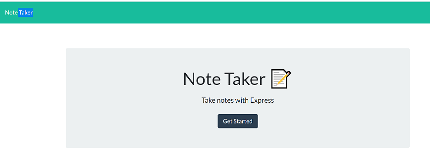
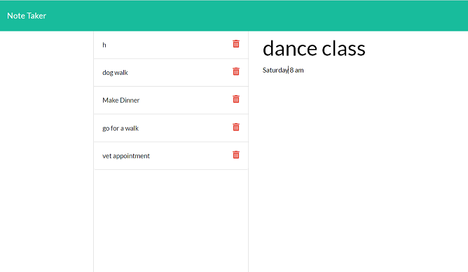

# Note Taker Application

## Description 

The purpose of this project was to build an application that can write, save, and delete notes using an express backend to save and retrieve note data from a JSON file. 

## Table of Contents
* [Description](#description)
* [Application](#application)
* [Technologies](#technologies)
* [Usage](#usage)
* [GitHub Repository](#Github)
* [Application](#gif)

## Technologies 

* HTML
* CSS
* JavaScript
* Node.js
* EXPRESS
* Path
* uiidv

## Usage

1- Node server.js
2- Navigate to localhost:3001
3- Click "Get Started"
4- Give the note a title and a body, then press save icon in the rop right corner.
5- To create a new note, click on the pencil icon
6- View your notes on the left-hand side. Click the red "X" to delete the note

## Heroku Deployed Link

* [Note Taker Application Heroku ](https://morning-crag-44493.herokuapp.com/)

## GitHub Repository

* [Note Taker Application GitHub Repository ]()

## Application 

